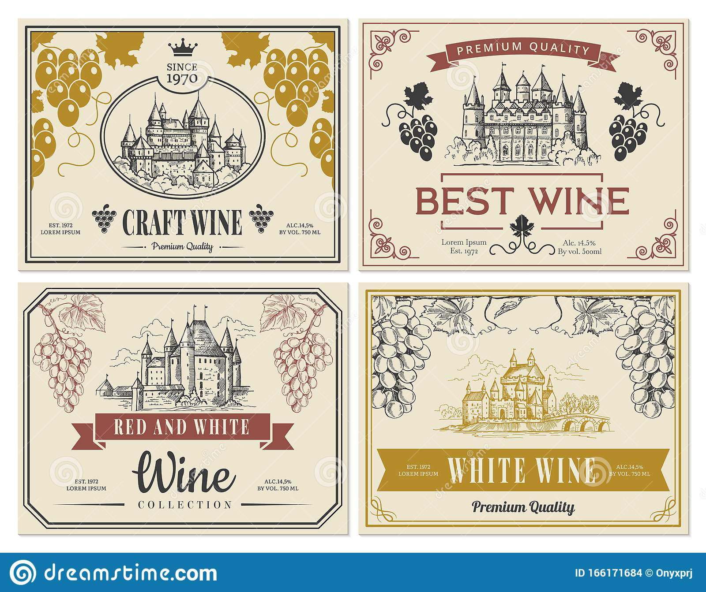

# Etikett

## Planering:

*Idé och inspiration:*  
I höstas blev det väldigt mycket äpplen. Jag och min systers sambo bestämde oss för att göra vin av dem i slutet av
oktober. Flera av flaskorna vi tappade upp vinet var begagnade men några av flaskorna hade inga etiketter. Jag fick en
idé om att det hade varit kul att göra egna etiketter någon gång. Vi hade ett internt skämt om att kalla det för
Bäpplevin gubbjävel men sen blev det inte så mycket mer. När kursen i digitalt skapande började kom idén tillbaka, det
hade varit väldigt kul att få gjort dem och se det som ett roligt projekt att sen faktiskt kunna använda etiketterna.

*Förarbete och val av verktyg:*  
Jag är väldigt intresserad och tycker om att måla och teckna. Så det kändes mest naturligt att skissa och sen rita min
egna etikett snarare än t.ex. ta en bild och bara lägga till text. Jag valde att hämta inspiration genom att googla ’vin
etiketter’ på google. Tog lite från olika typer som dök upp. Hade bestämt mig för en typ med inramning av en karaktär,
stor text och några få detaljer runt omkring. Gubben är inspirerad av en karaktär som illustratören ’Joe Todd Stanton’
la upp på sin instagram och som jag hade ett vagt minne av skulle passa väldigt bra som en maskot för gubbjävel vin.
Fastnade mest för mustaschen, det är den roligaste biten att måla.. och glasögonen. Jag gjorde några skisser i procreate
på min iPad. Fördelarna med att jobba på iPaden istället för på papper är att det är bekvämare med att kunna jobba i
lager. Klippa och klistra, flytta runt skissen och ångra kommandot. Dessutom slipper jag scanna in bilden när den är
klar. Har även större koll på upplösning och storlek.

## Genomförande:

Med tanke på det lite lustiga namnet och att det hela är ett internskämt som alla kanske inte hakar på så ville jag inte
att motivet skulle vara seriöst eller exklusivt. Lite små vardagligt och en hint av ironi. Jag hade en ganska klar bild
om hur jag ville att det skulle se ut, skissade lite olika varianter och valde sen ut den jag tyckte blev bäst och
gjorde om en ren lineart teckning och valde en bakgrundsfärg som kändes hyfsat neutral. Inte oengagerat vit men inte
heller något så uppseendeväckande som neon rosa. Jag jobbade större delen av den här processen med procreate på min iPad
med en Apple Pencil. Det är ett billigare program än photoshop men fungerar nästan på samma sätt. Jag övervägde att
använda gimp men då hade jag behövt använda mig av en ritplatta, jag kan inte rita med en mus tyvärr, till datorn och
jag känner mig mer bekväm med iPaden och pennan. Ett sätt hade varit om jag gjorde den på papper, scannade in och sen
gjorde vektorer i Inkscape men jag landade tillbaka på det som kändes bekvämast för mig.

När det kommer till den själva fysiska etiketten hade jag lite olika val. Mina föräldrar har en bläckskrivare och
tillgång till klister ark där det går att skriva ut etiketter på. Men det är som sagt bläck och etiketterna blir något
känsliga mot vatten. För att få en högre tryckkvalitet hade jag behövt beställa från ett tryckeri. Jag valde att testa
båda. Beställde från vistaprint. Jag gick faktiskt tillbaka till detta projektet efter att jag på började mina stämplar.
Jag gjorde ytterligare en etikett med tantfan. Hennes etikett genomfördes på samma vis men jag
hade inte tid att beställa från vistaprint denna gången utan det blev bara skrivaren hos mina föräldrar.

## Resultat:

Jag blev nöjd med resultatet, båda varianterna av etiketten har sina för och nackdelar men själva illustrationen syns
lika tydligt på båda. Tycker nog att jag fick fram vad jag föreställt mig. Så här i retrospekt hade det nog varit lite
roligt att göra mer med själva motivet, lite mer färger, detaljer, skuggor och så vidare.

##Digitala presentationsvägar:

Mina egna sociala medier eller hemsida. Skulle kunna ha den som ett exempel ifall någon skulle vilja ha en etikett
designad.