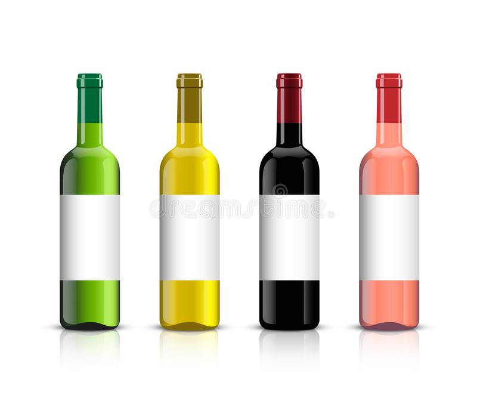

#Hemsida

##Planering:

*Idé och inspiration:*  
När jag var klar med etiketterna och stämplarna var faktiskt en hemsida det första som dök upp. Jag var lite i tankarna 
om hur jag skulle vilja visa upp mitt arbete och då kändes en hemsida naturligt. Det är ju ändå det vi suttit med mest på
den här utbildningen. Jag hittade en hemsida, grythyttanvin, som jag tyckte var väldigt fin och blev inspirerad av den.

*Förarbete och val av verktyg:*  
Eftersom jag jobbat i webstorm som mest den senaste tiden så valde jag att skriva där. Jag började dock på papper. Skissade
på olika layouter med grythyttan som huvudsaklig inspiration. Tog lite idéer från hemsidor jag gjort tidigare samt från
tutorials på W3School. 

##Genomförande:

Jag började med att skissa layouten på papper. Sen skapade jag ett repo på GitHub där jag kunde börja lägga upp allt.
I minn första skiss planerade jag att göra flera olika sidor och länka mellan dem. Tyvärr blev det lite för mycket. Magsjuka,
kompletteringsuppgift och grupparbete gjorde att det kändes som att jag inte skulle hinna. Så jag valde att göra om allt
till en sida och sedan länka ner i texten istället. Jag hade inga bra bilder att lägga på sidan dock så jag valde att 
måla mina egna. För header tänkte jag löv, som att koma in bland träden. Det kändes lite tomt så jag la till en vit 
logga förvinet ovanpå, ett enkelt gb med gamlebär och bäpple utskrivet. La även till made of sweden bara för att.
Jag gillade verkligen gubben så jag valde att göra som serierutor fast med ett recept från vinbanken och slänga in små
illustrationer av gubben på några olika ställen. Jag hade inga flaskor så jag målade egna i procreate. Tog även kort på 
stämplarna, justerade dem lite för att inte få med de fula kanterna på dem. Etikett bilderna la jag upp så som de ser ut 
på datorn.

##Resultat:

Det finns så mycket man skulle kunna göra med en hemsida. Jag försökte skala ner det för att hinna men hade jag haft mer
tid hade det varit kul att gå på min första idé med flera olika sidor och kanske en webbshop (inte för vinet dock, det
får vi inte göra i Sverige men kanske etiketterna och stämplarna). Hade velat använda mer JavaScript nästa gång. Tror
jag var lite less på det i och med kompletteringsuppgiften så det blev bara en liten bildkarusell men nästa gång hade jag
velat ha med en lite ålders pop-up där man måste välja att man är över 18 år. Verktygen för uppgiften fungerade som de 
skulle. 

##Digital presentation:

Hemsidan känns som en digital presentation i sig. Speciellt om man har tillgång till ett domän och sen kan länka det
vidare på olika sociala medier.