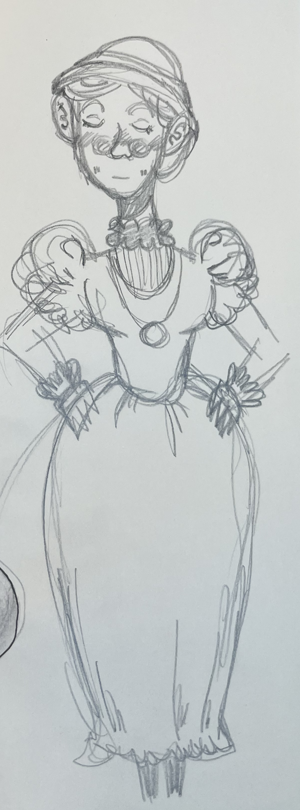
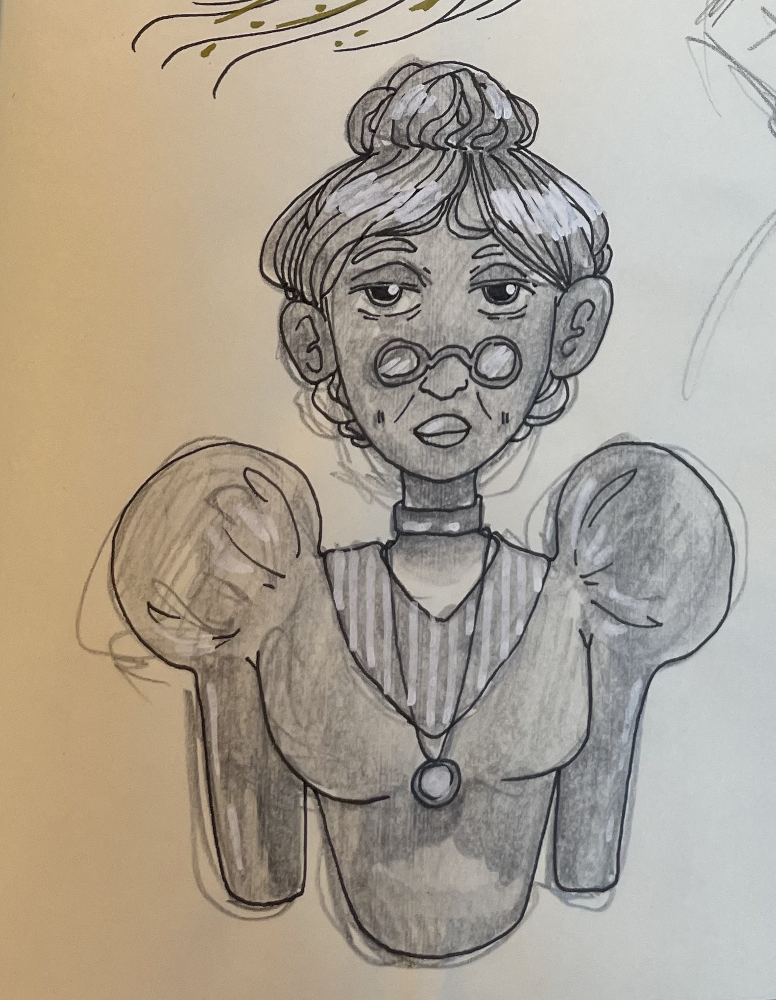

#Stämplar

##Planering:

*Idé och inspiration:*  
Själva tanken kom från projektet innan, etiketterna. Jag tänkte att det kunde vara kul med en logga av något slag, som
om man faktiskt skulle sälja vinet och ville ha en logga eller maskot. Jag är väldigt förtjust i gubbens design så jag
fastnade lite där. Jag har tidigare gjort stämplar av linoleum tryck och foam papper.

*Förarbete och val av verktyg:*  
Jag valde att använda mina linoleum knivar och tog den torra och hårda linoleum plattan jag hade kvar. Hade hellre velat
köpa foam eller en mjukare linoleum med klister som är lättare att sätta på en stämpel. Men jag valde att tänka
ekonomiskt och miljövänligt genom att använda det jag redan hade tillgängligt.

##Genomförande:

Jag började med att skissa gubbens huvud på plattan. Eftersom det bara var ett huvud behövde jag inte tänka så mycket på
vilket håll det skulle vara vänt. Tyvärr glömde jag det när jag skissade texten ”gubbjävel” och kom inte på det förrän
jag redan börjat skära. Jag hade kunnat börja om men valde istället att utesluta texten och klippte bort den. Det gick
så snabbt att göra gubben så det kändes som att jag behövde en karaktär till. Min systers sambo kom med ett förslag på
Gamlebärsvin Tantfan, han hade gjort en omgång med fläder och svartvinbärsvin så det skulle kunna passa.

##Resultat:

Trycken av stämplarna blev helt ok, de har lite karaktär med sin ojämnhet.

##Digital presentation:

Samma som med etiketterna, sociala medier eller en egen hemsida. 